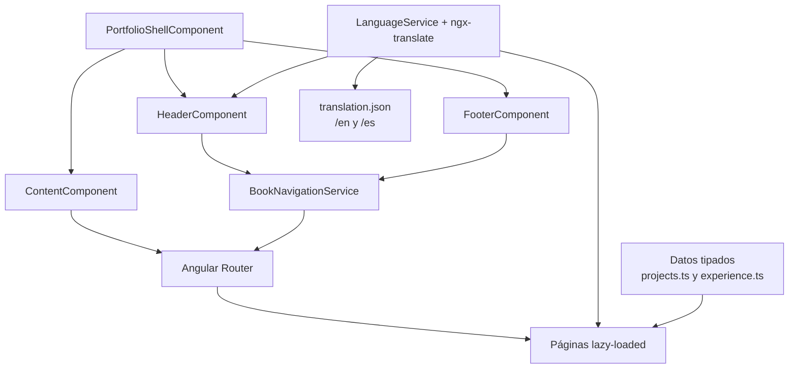
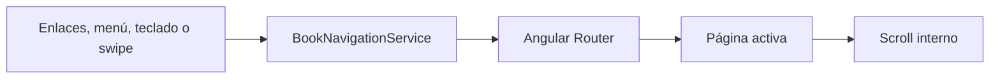

# The Blackswordsman Portfolio — Arquitectura

## Visión general

Portfolio estático construido con Angular y componentes standalone. La aplicación organiza el contenido como un libro digital responsive, con una cubierta inicial, navegación entre capítulos y páginas independientes para experiencia, proyectos, competencias y contacto.

La interfaz no depende de un backend propio: los datos del portfolio son tipados en TypeScript y los textos traducibles se cargan desde los diccionarios JSON de español e inglés.

## Arquitectura de la aplicación



El shell mantiene tres filas independientes para evitar solapamientos entre la cabecera, el contenido y el pie:

```css
grid-template-rows: auto minmax(0, 1fr) auto;
```

- `HeaderComponent`: navegación de escritorio, selector de idioma y menú móvil. No contiene una marca duplicada dentro del menú.
- `ContentComponent`: outlet de la ruta activa, scroll vertical y detección de swipe horizontal en dispositivos móviles.
- `FooterComponent`: navegación directa por capítulos y estado de la página actual.
- `PortfolioShellComponent`: composición global de la aplicación y control del viewport.

## Flujo de navegación



`BookNavigationService` centraliza el orden de los capítulos y las rutas de los proyectos. La navegación por swipe se apoya en Pointer Events, solo se activa en móvil, ignora elementos interactivos y diferencia la intención horizontal del scroll vertical.

## Capítulos y rutas

```text
Cover
About
Experience
Projects
Skills
Contact
  └── Project detail
      ├── intro
      ├── challenge
      ├── contribution
      ├── stack
      └── result
```

La portada funciona como hero responsive. Las páginas interiores usan una composición editorial sobre fondo tipo pergamino, pero son componentes Angular normales dentro del router; no existe una capa 3D que bloquee el contenido o la interacción.

## Proyectos y experiencia

Los proyectos académicos y profesionales se describen en `src/app/data/projects.ts` mediante modelos tipados y claves de traducción:

- RPG 2D desarrollado con Unity.
- Shooter 3D desarrollado con Unity.
- UR Chess, realizado durante la formación.
- YAYA, aplicación de recetas con Java y React Native.
- Monitor industrial en tiempo real con Node.js, TypeScript, PLC, Azure Event Bus, MongoDB, Angular y Azure Web Services.
- Gemelo digital de una instalación KNX con Node.js, TypeScript, Angular y Electron.

Las pantallas de detalle reutilizan una estructura común: introducción, reto, contribución, stack tecnológico y resultado. El panel de información mantiene scroll independiente cuando el contenido supera el espacio disponible.

## Competencias

`SkillsComponent` define la agrupación visual de las competencias y utiliza las traducciones para sus títulos y etiquetas. Todas las categorías se muestran con la misma estructura de tarjetas numeradas y barra horizontal:

```text
Programación · Frameworks · Bases de datos · Mensajería
Cloud · Herramientas e integración · Sistemas operativos
Idiomas · Metodologías
```

En escritorio, la columna descriptiva queda a la izquierda y el listado de información se desplaza a la derecha. En móvil, ambas áreas pasan a una sola columna.

## Contacto

La página de contacto presenta el título en la parte superior y, debajo, una composición vertical con:

- fotografía en `src/assets/img/PHOTO.jpeg`;
- correo: `williancepedaorduz@gmail.com`;
- LinkedIn;
- GitHub.

No incluye formulario ni el texto promocional de “tienes un proyecto en mente”.

## Internacionalización

```text
src/assets/languages/
├── en/translation.json
└── es/translation.json
```

`TranslateHttpLoader` obtiene los diccionarios desde `/assets/languages/{language}/translation.json`. `LanguageService` mantiene el idioma seleccionado, actualiza el atributo `lang` del documento y lo persiste en el almacenamiento local.

Las claves de traducción se consumen directamente desde las plantillas y componentes que las necesitan. La configuración de Angular copia `src/assets` al directorio público `assets` durante el build.

## Diseño responsive

Los breakpoints están centralizados en `ResponsiveLayoutService`:

- móvil: menos de `768px`;
- tablet: entre `768px` y `1199px`;
- escritorio: desde `1200px`, si la altura disponible lo permite;
- viewport bajo: menos de `700px` de alto.

En escritorio se utiliza navegación horizontal y dos columnas para las páginas de contenido. En móvil se usa una cabecera compacta, menú a pantalla completa, una sola columna, insets para safe areas y unidades `dvh` para aprovechar correctamente el viewport.

## Estructura del código

```text
src/
├── app/
│   ├── core/
│   │   ├── models/
│   │   └── services/
│   ├── data/
│   │   ├── experience.ts
│   │   └── projects.ts
│   ├── features/
│   │   ├── cover/
│   │   ├── about/
│   │   ├── experience/
│   │   ├── projects/
│   │   ├── skills/
│   │   └── contact/
│   ├── layout/
│   │   ├── header/
│   │   ├── content/
│   │   ├── footer/
│   │   ├── navigation/
│   │   └── portfolio-shell/
│   └── shared/
├── assets/
│   ├── img/
│   └── languages/
└── public/assets/
    ├── images/
    └── svg/
```

## Recursos y despliegue

La aplicación se genera como contenido estático y puede desplegarse en Vercel, Cloudflare Pages, Netlify o cualquier servidor de archivos estáticos compatible con fallback de rutas Angular.

Las imágenes de ambientación proceden de Pixabay y los iconos SVG de SVG Repo, ambos utilizados como recursos open source según sus respectivas licencias. La fotografía del perfil pertenece al portfolio y se sirve desde `src/assets/img/PHOTO.jpeg`.
